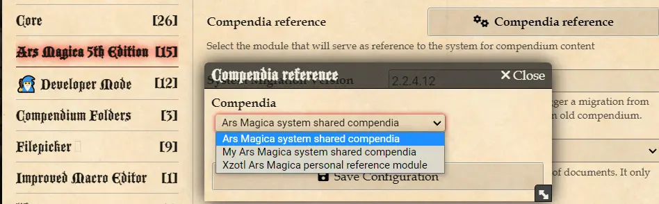
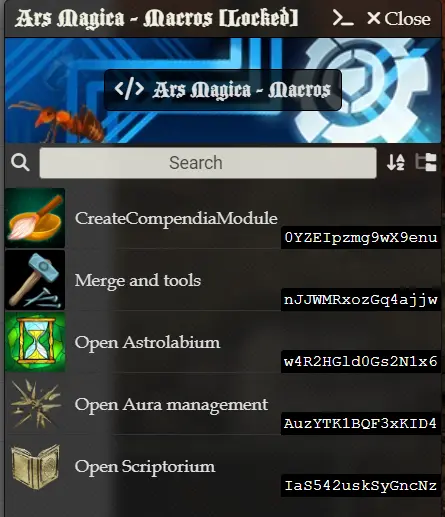
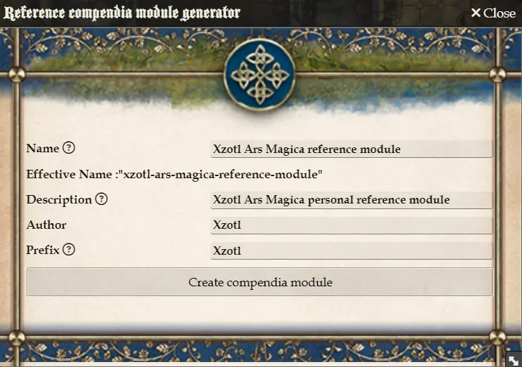
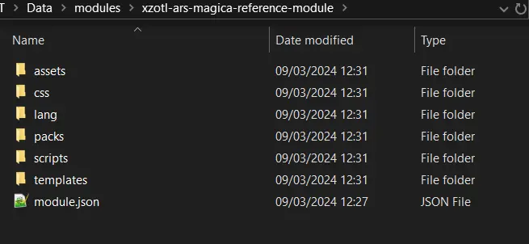

# Ars Magica Compendia

Module name
: arm5e-compendia


Reference and template for personal shared compendia used with the [Ars Magica 5th Edition system for Foundry VTT](https://foundryvtt.com/packages/arm5e)

---

This package is intended to enable Ars Magica play using Foundry VTT. In order to play, official Ars Magica materials are still required. Official material for Ars Magica 5th edition is published by and may be purchased from Atlas Games (<https://atlas-games.com>).

Ars Magica content is copyright Trident, Inc d/b/a Atlas Games. Ars Magica, Mythic Europe, and Covenants are trademarks of Trident, Inc. Order of Hermes and Tremere are trademarks of White Wolf, Inc. USED WITH PERMISSION.

The use and inclusion of the logo, icon and art elements, as well as the use of terms, has been expressly authorized in written form by Holocubierta Ediciones, S.L. (<https://www.holocubierta.com/>), the licensee of the game Ars Magica 5th Edition for its publication in Spanish.

---

## Why this module?

- As you noticed, for copyright reasons, descriptions are empty in the system compendia. That's why most of us use a custom compendium with the descriptions filled (or in another language). This put limitations to what the system can do, for example:

  - The need to have an ability at 0 in your character before being able to learn or be taught about it, because there is a good chance that it is not the system ability you want to add, but with the description filled by yourself or in another language.
  - Inhability to automatically add some abilities at character creation as most of the time the ones added are not the desired ones (ie: empty description or wrong language)

- This new module can be updated without the need of a system release.
- It will serve as a template for your own shared compendia, with your own descriptions filled, in the language you prefer (see below for instructions)
- A setting will allow you to choose the reference module to be used by the system (it will fallback to the system reference if something is missing).
- Room for a premium official module in the future? Who knows...

## Usage

Find below the different ways to use the module in incremental technical complexity. I recommand at least the "nobility" one for long term use.

Once you have done one of the methods below, go to the system configuration and select your new compendium:


### Usage for the mundane

The module is now a mandatory dependency to the system, it should be installed automatically.

If for some reason it wasn't installed, you can install it as another module in Foundry VTT using the manifest link below, it will contain all the compendia the system has/use to have.

Manifest link
: <https://github.com/Xzotl42/arm5e-compendia/releases/latest/download/module.json>

**Important**
: **You need to lock the package or any update will overwrite your changes**

- Activate the module in your world.
- Unlock a compendium and edit as you wish

#### The good

- Very easy to put in place

#### The bad

- It is static and won't receive the latest features and active effects implemented for the system in ulterior versions

### Usage for the nobility

This will demand a little work on your side, but it should be only once. Support and data migration will be provided "in app" for this one.

- Install the module using the manifest link above (update: it should be done automatically now)
- As a GM run the macro named "CreateCompendiaModule"
  
- Fill the fields of the dialog:
  
- Click the generation button
- **Important step : quit the Foundry app or stop the Foundry server**
- Go in the Foundry VTT data folder
- In the module subfolder, you will find the arm5e-compendia subfolder and your newly created module skeleton.
- COPY (ie: not move) the following folders from arm5e-compendia to the new module:

  - assets
  - css
  - lang
  - packs
  - scripts
  - templates
    

- Start Foundry VTT, your world and enable your new personal module. That's it!

#### The good

- You can add customization to the system by editing the module script.
- You get support and migration scripts when new features are added.
- You can add new descriptions and translations as needed.

#### The bad

- Harder to contribute to the system

### Usage for the Hermetic Magus

This step demands a little technical knowledge but offers more possibilities and control

- Install node version 18+

Optionally:

- Install git
- Have a github account
- Fork the repository
- Check out the repository locally `git clone git@github.com:<MY_USERNAME>/arm5e-compendia.git`

Check [here](https://gist.github.com/Chaser324/ce0505fbed06b947d962) for more information on GIT usage in that context

Warning and reminder: Unless you have private repository, you cannot put the content of your compendia with full description on github for copyright reasons.

#### Installing

In a terminal, go the directory of the project and install all dependencies (ie: Foundry CLI)

```
npm install
```

#### Unpacked documents repository

The "unpacked" directory contains all the documents of all the compendia of the module. One file in json format per document, one subfolder per compendium.
You could edit them by hand, but don't unless you know what you are doing.

#### Packing the file into Foundry VTT databases

Warning: For convenience you can have the repository directly in the modules folder but do NOT run those scripts when a world is open in Foundry!

At that stage, the module is not usable as there is no compendium.

```shell
npm run pack
```

The command above will generate compendium files for Foundry V10 and V11 based on the content of the unpacked directory.

You can then load Foundry and edit as you wish.

#### Unpacking the databases to json files

After editing, close the world and run (V11 only)

```shell
npm run unpack
```

It will create or update files in the unpacked folder based on your changes.

## Contributing

This is an open-source project and we encourage fellow developers to contribute and help improve it!

1. Fork it.
2. Create your feature branch (`git checkout -b my-new-feature`).
3. Contribute!
4. Commit your changes (`git commit -m 'Add new feature'`).
5. Push to the branch (`git push origin my-new-feature`).
6. Create a pull request.

You can also [join our Discord community](https://discord.gg/DdDetc9SYP).
